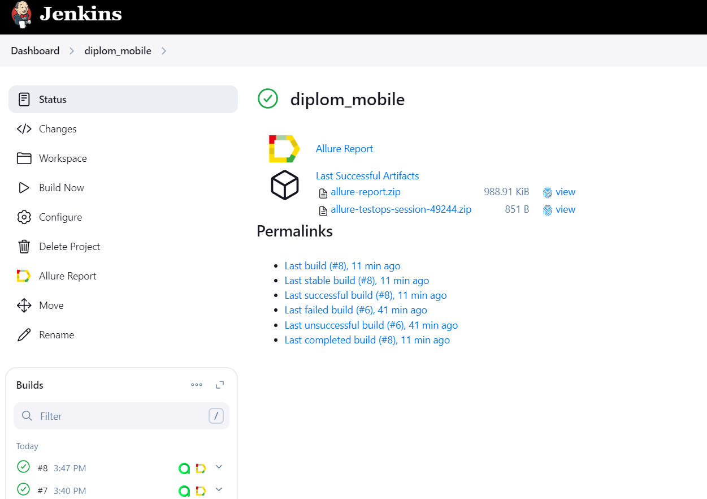
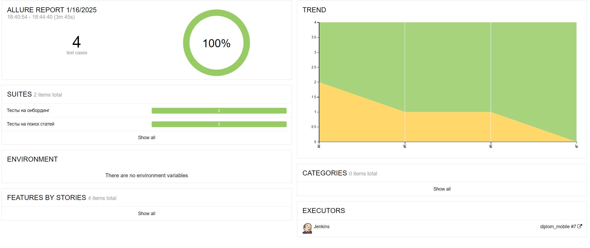
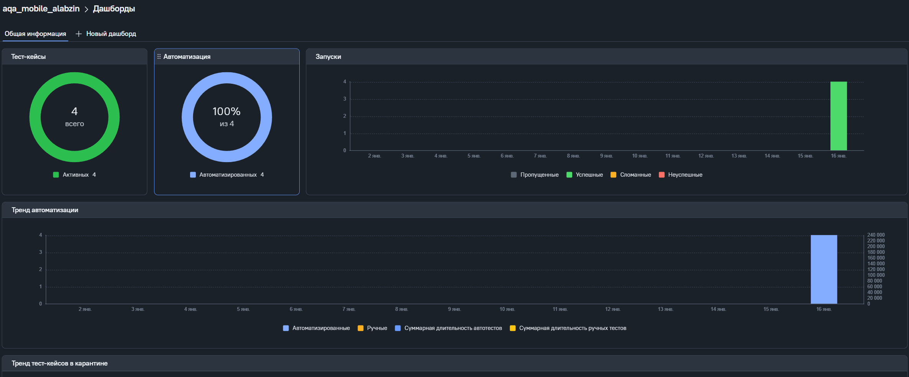
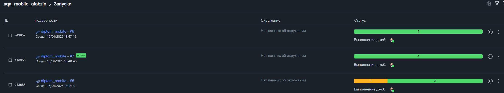
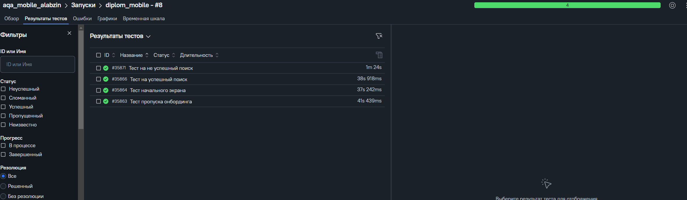
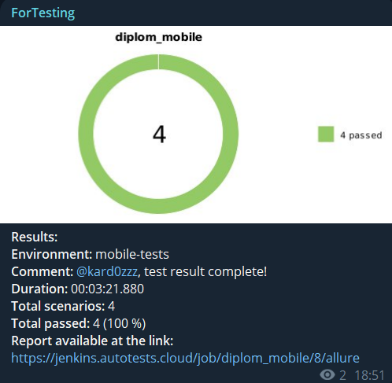

# Проект по автоматизации тестирования мобильного приложения Wikipedia


## :pushpin: Содержание:

- [Используемый стек](#computer-используемый-стек)
- [Запуск автотестов](#arrow_forward-запуск-автотестов)
- [Сборка в Jenkins](#-сборка-в-jenkins)
- [Пример Allure-отчета](#-пример-allure-отчета)
- [Интеграция с Allure TestOps](#-интеграция-с-allure-testOps)
- [Уведомления в Telegram](#-уведомления-в-telegram)

## :computer: Используемый стек

<p align="center">
<a href="https://www.jetbrains.com/">

</a>
<a href="https://www.java.com/">

</a>
<a href="https://docs.qameta.io/allure/">

</a>
<a href="https://qameta.io/">

</a>
<a href="https://gradle.org/">

</a>
<a href="https://junit.org/junit5/">

</a>

<a href="https://appium.io/">

</a> 
<a href="https://github.com/">

</a>
<a href="https://www.jenkins.io/">

</a>
<a href="https://web.telegram.org/">

</a>
</p>

- Тесты в данном проекте написаны на языке Java с использованием фреймворка для автоматизации мобильных приложений [Appium](https://appium.io/)
- В качестве сборщика был использован [Gradle](https://gradle.org/)
- [JUnit5](https://junit.org/junit5/) задействован в качестве фреймворка модульного тестирования
- Для удаленного запуска реализована джоба в [jenkins](https://www.jenkins.io/) с формированием Allure-отчета и
  отправкой результатов в <code>Telegram</code> при помощи бота
- Осуществлена интеграция с [Allure TestOps](https://docs.qameta.io/allure/)

## :spiral_notepad: Список тестов

:white_check_mark: Тест начального экрана <br />
:white_check_mark: Тест на пропуск начального экрана <br />
:white_check_mark: Успешный поиск статей <br />
:white_check_mark: Не успешный поиск статей <br />


### Варианты запуска тестов

- ```emulator``` -Запуск тестов на эмуляторе.
- ```browserstack``` -Запуск тестов на browserstack.
> Для локального запуска через browserstack потребуется создать auth.properties в src/test/properties и указать name и key пользователя.

> Для локального запуска через emulator потребуется выполнить установку и [настройку](https://autotest.how/appium-setup-for-local-android-tutorial-md) эмулятора
### Запуск тестов из терминала

```
./gradlew clean mobile_tests -DdeviceHost=emulator
./gradlew clean mobile_tests -DdeviceHost=browserstack
```

При выполнении команды тесты запустятся локально.

##  [Сборка в Jenkins](https://jenkins.autotests.cloud/job/diplom_mobile/)


<p align="center">

</p>

##  [Пример Allure-отчета](https://jenkins.autotests.cloud/job/diplom_mobile/7/allure/)

#### Главная страница отчета Allure содержит следующие блоки:

- <code><strong>*ALLURE REPORT*</strong></code> - отображает дату и время теста, общее количество запущенных тестов, а
  также диаграмму с процентом и количеством успешных, упавших и сломавшихся в процессе выполнения тестов
- <code><strong>*TREND*</strong></code> - отображает тенденцию выполнения тестов для всех запусков
- <code><strong>*SUITES*</strong></code> - отображает распределение тестов по сьютам
- <code><strong>*CATEGORIES*</strong></code> - отображает распределение неудачных тестов по типам дефектов

<p align="center">

</p>


##  [Интеграция с Allure TestOps](https://allure.autotests.cloud/project/4567/launches)

#### На вкладке Dashboards отображается:

- Количество тест-кейсов и их статус
- Соотношение ручных/автоматизированных тестов
- Результаты запусков/прохождения тестов в графике по датам

<p align="center">

</p>

#### На вкладке Launches можно увидеть:

- Результаты запусков автоматизированных тестов
- Результаты запуска тестов из Allure TestOps

<p align="center">

</p>
``

<p align="center">

</p>


###  Уведомления в Telegram

После завершения сборки, бот, созданный в <code>Telegram</code>, автоматически обрабатывает и отправляет сообщение с
результатом.
<p align="center">

</p>

<a id="video"></a>
## <a name="Видео прохождения тестов">**Видео прохождения тестов**</a>

<p align="center">
   
</p>